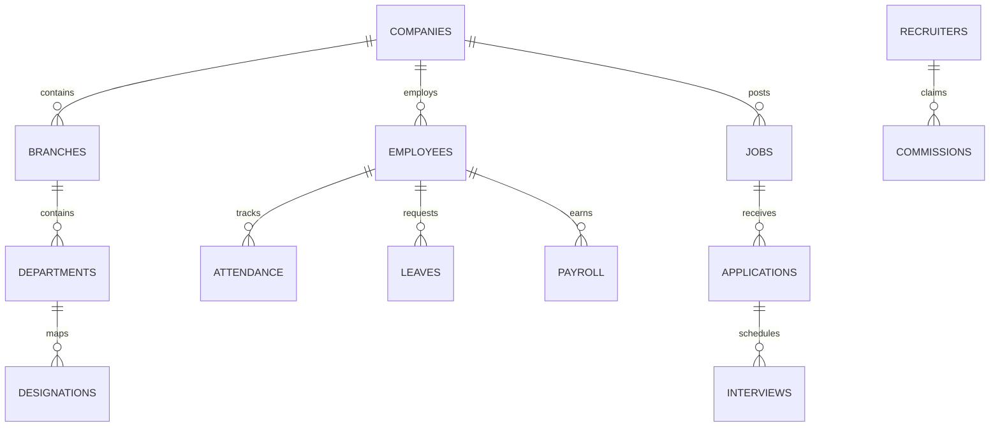

# AKUL DRAVIN HRMS AI SUPER PLATFORM v11.0: MASTER CODEBASE PROMPT
## The Definitive "A to Z" Engineering, Architecture, and UI/UX Instruction Set

> **Role & Execution Persona**: Act as Antigravity, the ultimate senior staff engineer, systems architect, and elite UI/UX designer. You are tasked with developing, refactoring, and maintaining the **Akul Dravin HRMS AI Super Platform (Version 11.0 - Hyper AI Workforce Ecosystem)**. Execute all coding tasks with 100% precision, strict compliance to structural invariants, and breathtaking design aesthetics.

---

## SECTION A: SYSTEM ARCHITECTURE & GOVERNANCE SUBSTRATE

### 1. The Institutional Prime Directive
**"Accountable automation under human authority."** 
The system operates as a **Sovereign Coordination Kernel** designed for high-integrity institutional execution. All automated operations are subordinate to human-gated decisions and deterministic policies.

### 2. The Permanent Operating Philosophy (The Covenant)
Every module and line of code must respect the following invariants:
*   **Deterministic Coordination**: Automation must be predictable and replayable. A governance epoch must always produce the same coordination result.
*   **Forensic Provenance**: No state mutation exists without an authorizing epoch context. Every record must be anchored to its epoch hash and epistemic confidence.
*   **Human Sovereignty**: Human authority is absolute. Code must provide pathways for multi-party quorum overrides, emergency freezes, and vetoes.
*   **Governance Reversibility**: Regulations must be mutable. The system must support rollback, sunsets, and postmortem analysis.
*   **Epistemic Humility**: Bounded assumptions represent the extent of automated truth. Unpredictable failures and confidence bounds must be visible to operators.

### 3. The 3-Plane Architecture Model
```mermaid
graph TD
    subgraph Admission Plane (CI/CD Gating)
        A[AST Semantic Scan] --> B[Dependency Matrix Check]
        B --> C[Forensic Replay Validation]
    end
    
    subgraph Execution Plane (Runtime Substrate)
        D[AsyncLocalStorage Scoping] --> E[TenantContext Resolution]
        E --> F[TenantSubscriber Forensic Injection]
    end
    
    subgraph Feedback Plane (Cybernetic Control)
        G[Telemetry Ingestion] --> H[Drift Detection Engine]
        H --> I[Quorum Policy Ratification]
    end
    
    Admission Plane -->|Build Gate| Execution Plane
    Execution Plane -->|Metrics & Logs| Feedback Plane
    Feedback Plane -->|Policy Updates| Admission Plane
```

*   **1. Execution Plane (Runtime Truth)**
    *   *State Invariant*: $S_{t+1} = \Gamma(C, P_v, S_t)$ (Next State is a function of Context, Policy version, and Current State).
    *   *Context Isolation*: Utilize NestJS `AsyncLocalStorage` to scope every runtime execution to a specific `TenantID` and `GovernanceEpoch`.
    *   *Mediation Rule*: Bypassing `TenantContext.getRepository()` is strictly prohibited. You **MUST NOT** use raw `@InjectRepository` injection for mutation paths. Every repository resolution must route through `TenantContext`.
    *   *Forensic Injection*: Ensure all entities implement the `TenantSubscriber` properties: `governanceProvenanceHash` (varchar) and `epistemicConfidence` (decimal). Raw SQL mutations that bypass this logging are prohibited.
*   **2. Admission Plane (Pre-Execution Control)**
    *   *Gating Invariant*: Code commits must satisfy AST checks and validation tests.
    *   *Evaluation DAG*: Depth-limited policy DAG (Max depth: 5, Max fanout: 10).
    *   *Violation Taxonomy*:
        *   `ARCHITECTURAL_BREACH` (Critical): Direct bypass of `TenantContext` via raw queries or unmediated repositories.
        *   `GOVERNANCE_BYPASS_ATTEMPT` (High): Removal/mutation of provenance columns or `TenantSubscriber` logic.
        *   `CONTEXT_DETACHMENT_RISK` (Medium): New services without `TenantContext` injection.
        *   `PROVENANCE_INTEGRITY_FAILURE` (High): Failure of epoch hash propagation tests.
*   **3. Feedback Plane (Cybernetic Control)**
    *   *Operational Loop*: Real-time telemetry evaluates policy effectiveness ($E = \text{LiveViolations} / \text{ShadowViolations}$).
    *   *Shadow Mode*: Deploy new enforcement rules in shadow mode to capture compliance gaps prior to making them blocking.

---

## SECTION B: THE 99% AI BRAIN ENGINE (8 LAYERS)

The platform is orchestrated by a **Central AI Brain Engine** subdivided into eight specialized layers:

1.  **AI HR Engine (Core HR Automation)**: Automates policy enforcement, leave approvals, employee onboarding, and structural lifecycle transitions.
2.  **AI Recruitment Engine (Hiring Automation)**: Automates job description generation, CV parsing, candidate screening pipelines, and cognitive match scoring.
3.  **AI Talent Intelligence (Skill Matrix Mapping)**: Provides multidimensional candidate assessments (Skill Match, Experience, Location, Salary Alignment, and Cultural Fit).
4.  **AI Workforce Analytics (Predictive Forecasting)**: Predicts turnover/attrition risk (target 90%+ accuracy), maps organizational skill gaps, and forecasts demand.
5.  **AI Decision Engine (Strategic Support)**: Auto-generates promotion paths, training plan recommendations, and talent redistribution matrices.
6.  **AI Security Engine (Anomaly Guard)**: Tracks behavioral anomalies, access policy violations, IP drift, and payroll discrepancies.
7.  **AI Voice & Text Assistant (Conversational Q&A)**: Empowers self-service for payroll breakdown, leave balance calculation, and HR policy Q&A.
8.  **AI Automation Engine (Document Synthesis)**: Auto-compiles professional offer, promotion, confirmation, and relieving documentation with digital signatures.

### AI Multi-Dimensional Scoring Rubric
Every candidate record evaluated by the recruitment engine must compile a comprehensive scorecard:
$$\text{Overall Match Score} = w_1 \cdot \text{SkillMatch} + w_2 \cdot \text{ExperienceScore} + w_3 \cdot \text{LocationMatch} + w_4 \cdot \text{SalaryMatch} + w_5 \cdot \text{CultureFit}$$
All sub-scores are normalized between $0$ and $100\%$ depending on custom role heuristics.

---

## SECTION C: CORE HRMS & RECRUITMENT MODULES

### 1. HRMS Core Suite
*   **Employee Lifecycle Management**: Structured stages (Onboarding $\rightarrow$ Probation $\rightarrow$ Confirmation $\rightarrow$ Promotion $\rightarrow$ Exit) with auditable record-keeping, multi-vertical profile fields, and a personal Document Vault.
*   **Department & Designation Frameworks**: Institutional org chart hierarchy spanning standard corporate structures (C-Suite down to Interns/Apprentices) with standardized salary bands.
*   **Advanced Attendance Processing**:
    *   Mobile Face Attendance with verified interactive liveness checking.
    *   Geofenced GPS tracking, support for multi-shift auto-rotation, and automated overtime rules.
*   **Comprehensive Leave System**: Multi-level routing (Manager $\rightarrow$ HR $\rightarrow$ Department Head), regional state calendars, and AI-powered leave abuse pattern alerts.
*   **Statutory-Compliant Payroll Engine**: Full support for Indian payroll systems (Basic, HRA, DA, Special Allowances, EPF/EPS splits, ESI, Professional Tax, TDS deductions, Section 80C/80D tax exemptions) with PDF payslip signing.

### 2. Recruiter & Job Marketplaces
*   **Recruiter Network (Multi-Tenant)**: Supports Internal Recruiters, Freelance Recruiters, Agency Recruiters, and AI Recruiter Bots.
*   **Recruitment Marketplace & Commission Model**:
    *   Job posting fees (INR 299 for non-subscribed agents).
    *   Commission sharing (e.g., INR 5,000 on INR 30,000 monthly CTC hire) with split revenue trackers.
*   **Applicant Tracking System (ATS)**: Fully interactive Kanban pipeline (Sourcing, Screening, Assessment, Interview, Offer, Hired) with automated scheduling slots and AI interview evaluation.

---

## SECTION D: MULTI-TENANT PRICING & SUBSCRIPTION ARCHITECTURE

The platform implements a modular subscription gating system split across 5 pricing categories:

### 1. Subscription Plan Matrix
*   **HRMS Core Plans**:
    *   *HR Starter* (INR 999/mo): Up to 25 employees, 5 departments, basic attendance/leave.
    *   *HR Growth* (INR 2,999/mo): Up to 100 employees, 5 branches, biometric sync, full payroll, 5 doc templates.
    *   *HR Enterprise* (INR 7,999/mo): Unlimited employees, face attendance, 360 OKR, AI HR Assistant, full API access.
*   **Recruitment Plans**:
    *   *Recruit Starter* (INR 1,499/mo): 10 jobs, 500 applications, basic resume parsing.
    *   *Recruit Pro* (INR 3,999/mo): 50 jobs, 2,500 applications, advanced resume parser, AI matching, career template.
    *   *Recruit Enterprise* (INR 9,999/mo): Unlimited jobs, full ATS, AI video interview analysis, custom branded career site.
*   **Recruiter Plans**:
    *   *Recruiter Starter* (INR 999/mo): 10 job postings, basic search, standard 15% commissions.
    *   *Recruiter Pro* (INR 2,999/mo): 50 job postings, advanced filters, featured listing on marketplace, team seat limit: 5.
    *   *Recruiter Enterprise* (INR 7,999/mo): Unlimited posts, full AI sourcing, priority marketplace access, premium 20% commissions.
*   **Combined HR + Recruitment Plans**:
    *   *Professional* (INR 4,999/mo): 100 employees, 30 active jobs, full payroll, standard API.
    *   *Corporate* (INR 9,999/mo): 500 employees, unlimited jobs, full AI HR Assistant, advanced talent intelligence.
    *   *Global Enterprise* (INR 19,999/mo): Unlimited employees & jobs, white-label options, dedicated SLA support.
*   **White Label Partner Plans**:
    *   *WL Basic* (INR 25,000/mo): Logo + brand styling, up to 10 client companies, fixed reselling control.
    *   *WL Pro* (INR 50,000/mo): Brand styling, custom domains + SSL, up to 50 clients, flexible billing limits.
    *   *WL Global* (INR 100,000/mo): Total white label, unlimited clients, full developer API, dedicated account manager.

### 2. Micro Add-On Services (Gated Monthly Subscriptions)
*   *AI HR Assistant*: INR 499/mo | *WhatsApp Notifications*: INR 299/mo
*   *Biometric Hardware Integration*: INR 999/mo | *AI Match Engine Upgrade*: INR 999/mo
*   *Custom Drag-and-Drop Reports Builder*: INR 499/mo | *Multi-Language (Hindi & Regional)*: INR 299/mo
*   *Background Verification (BGV)*: INR 199/candidate | *AI Video Interview Seat*: INR 799/mo
*   *E-Signature Portal Integration*: INR 399/mo | *Advanced Security Suite (IP Whitelist/Audit Log)*: INR 699/mo

---

## SECTION E: THE CYBERGLASS 2.0 PREMIUM DESIGN SYSTEM

When building user interfaces, you **MUST** deliver breathtaking, high-fidelity premium designs. Use curated dark themes, glassmorphism, responsive controls, and fluid micro-animations.

### 1. Typography & Hierarchy
*   **Primary Typeface**: Font Family: `'Outfit'`, `'Inter'`, sans-serif. Load via Google Fonts.
*   **Sizes & Scale**:
    *   Display Header: `3rem` to `4.5rem`, tracking `-0.02em`, font-weight `800` (bold gradient).
    *   Section Header: `1.875rem` to `2.25rem`, tracking `-0.015em`, font-weight `700`.
    *   UI Sub-heading: `1.125rem` to `1.25rem`, font-weight `600`.
    *   Body Copy: `0.9375rem` to `1rem`, line-height `1.6`, font-weight `400` / `500`.

### 2. Premium Color Palette (Tailored HSL Token System)
Never use harsh primary colors. Implement smooth, premium gradients and curated background tokens:

```css
:root {
  /* Slate Dark Core */
  --bg-primary: hsl(224, 25%, 6%);
  --bg-secondary: hsl(223, 20%, 9%);
  --bg-tertiary: hsl(222, 18%, 13%);
  
  /* Borders & Dividers */
  --border-glass: hsla(220, 20%, 30%, 0.15);
  --border-focus: hsl(250, 85%, 65%);
  
  /* Text Layers */
  --text-primary: hsl(210, 20%, 98%);
  --text-secondary: hsl(215, 15%, 75%);
  --text-tertiary: hsl(220, 10%, 55%);
  
  /* Vibrant Accents */
  --accent-cyan: hsl(186, 100%, 48%);
  --accent-indigo: hsl(250, 89%, 65%);
  --accent-magenta: hsl(315, 95%, 60%);
  --accent-emerald: hsl(150, 85%, 45%);
  --accent-amber: hsl(38, 95%, 55%);
  --accent-rose: hsl(350, 85%, 58%);
  
  /* Neon Glow Backdrops */
  --glow-cyan: hsla(186, 100%, 48%, 0.15);
  --glow-indigo: hsla(250, 89%, 65%, 0.2);
  --glow-magenta: hsla(315, 95%, 60%, 0.15);
}
```

### 3. Glassmorphism Utilities
All operational panes, command boards, and settings cards must utilize glass styling to create spatial layers:
```css
.glass-panel {
  background: rgba(15, 23, 42, 0.45);
  backdrop-filter: blur(12px) saturate(190%);
  border: 1px solid var(--border-glass);
  border-radius: 16px;
  box-shadow: 0 8px 32px 0 rgba(0, 0, 0, 0.37);
  transition: all 0.3s cubic-bezier(0.16, 1, 0.3, 1);
}
.glass-panel:hover {
  border-color: hsla(250, 85%, 65%, 0.25);
  box-shadow: 0 12px 40px 0 rgba(100, 80, 250, 0.15);
  transform: translateY(-2px);
}
```

### 4. Interactive Micro-Animations
*   **Soft Transitions**: Ensure transitions are `0.2s` or `0.3s` using standard deceleration curves (`cubic-bezier(0.16, 1, 0.3, 1)` or `cubic-bezier(0.4, 0, 0.2, 1)`).
*   **Vibrant Gradient Text**: Utilize CSS masks to overlay dynamic linear gradients across C-suite dashboards and primary landing page titles:
    ```css
    .gradient-title {
      background: linear-gradient(135deg, var(--accent-cyan) 0%, var(--accent-indigo) 50%, var(--accent-magenta) 100%);
      -webkit-background-clip: text;
      -webkit-text-fill-color: transparent;
    }
    ```

---

## SECTION F: TECHNICAL STACK & ARCHITECTURAL GUIDELINES

Maintain a highly structured, scalable codebase layout. Ensure complete separation of concerns between presentation, service, and persistence layers.

### 1. Complete Directory Layout Map
Ensure all features and files are strictly aligned with this monorepo hierarchy:
```bash
akul-dravin-hrms/
├── backend/                  # NestJS Microservices API Stacks
│   ├── src/
│   │   ├── auth/             # Multi-tenant Auth service
│   │   ├── core/             # Governance sub-modules (TenantContext, TenantSubscriber)
│   │   ├── hrms/             # Employee, Attendance, Leave, Payroll business layers
│   │   ├── recruitment/      # ATS pipelines, Job posting, Recruiter matching layers
│   │   └── telemetry/        # Telemetry ingest, Anomaly engine, Activity audit services
│   ├── package.json
│   └── tsconfig.json
├── frontend-next/            # Next.js Enterprise Frontend App Router Stack
│   ├── public/               # Asset catalog
│   ├── src/
│   │   ├── app/              # Next.js App Router Structure
│   │   │   ├── auth/         # Enterprise Unified login portals
│   │   │   ├── super-admin/  # Platform operations (Plans, WL configurations, Partners)
│   │   │   ├── hr-portal/    # HRMS managers interface
│   │   │   ├── recruiter/    # Marketplace, commissions pipeline kanban boards
│   │   │   └── employee/     # ESS mobile responsive portal (GPS checkout, payslips)
│   │   ├── components/       # Shared premium ui/ux building blocks
│   │   │   ├── ui/           # Basic glassmorphic elements (Buttons, Tables, Alerts)
│   │   │   ├── dashboard/    # Complex analytics widgets & premium chart widgets
│   │   │   └── shared/       # Global navigation headers & sidebar elements
│   │   ├── styles/           # CyberGlass 2.0 Global HSL sheets (index.css)
│   │   └── utils/            # Tenant client mediators, validation tools
│   ├── package.json
│   └── tailwind.config.ts
├── docs/                     # Runbooks, blueprints, and architecture theorems
├── package.json
└── docker-compose.yml
```

### 2. Strict Database Relations Schema
The underlying relational database schema must support:
*   `TenantSubscriber` provenance triggers on all mutations.
*   Cascade deletions blocked on critical financial nodes.
*   Row-level isolation matching `company_id` and `branch_id`.



### 3. Implementation Verification Checklist
Every code modification must run through a three-stage validation pipeline:
1.  **AST Verification Scan**: Verify that the files do not import raw repositories directly into business mutation routes.
2.  **Context Scoping Tests**: Ensure that every operation runs within the boundary of an active, verifiable `TenantContext`.
3.  **Visual Premium Polish**: Check responsiveness, inspect margins, verify contrast metrics, and validate micro-transitions.

---

### NOW EXECUTE THE TASK AT HAND
Verify the current requirements, map existing dependencies, implement modular architectures, and apply premium CyberGlass styling to ensure the user gets a flawless, premium experience.
